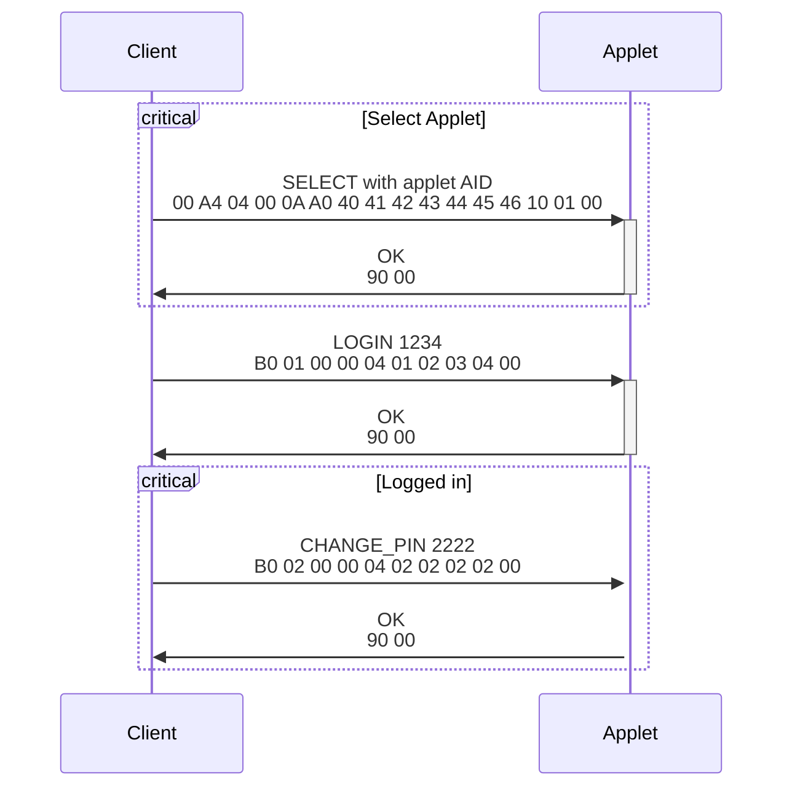
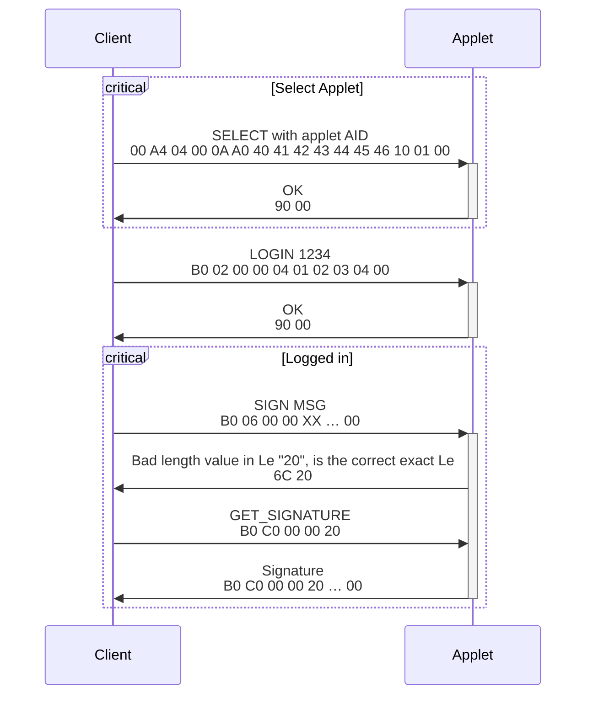
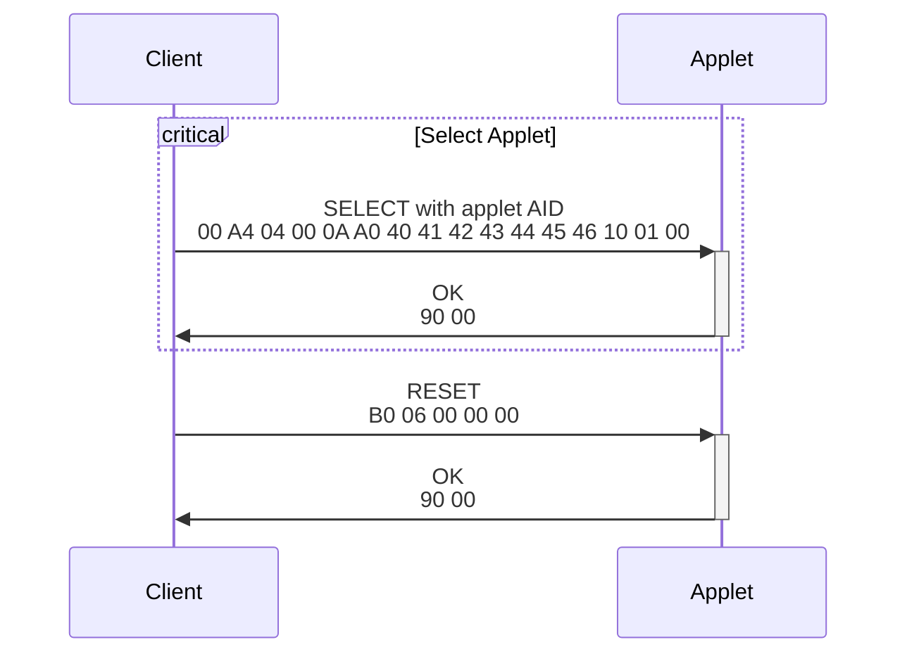

# Projet SAVAcard

## Description

Nom : Secure + Java + Javacard = SAVAcard

## Les deux projets

Ce projet contient deux sous-projets

- Le projet `Server` ou `Card` dans le dossier [`javacard`](javacard/README.md)
- Le projet `Client` ou `Terminal app` dans le dossier [`javacard_host`](javacard_host/README.md)

## Introduction

Le but du projet est de développer un applet JavaCard permettant de stocker de manière sécurisée une paire de clé RSA générée par celle-ci. L'applet agit comme une TEE (Trusted Execution Environment) et fournit un ensemble de fonctionnalités à l'utilisateur utilisant la paire de clé générée. L'utilisateur doit d'abord s'authentifier en fournissant le code PIN qui sécurise l'applet. Ensuite, l'utilisateur peut signer des messages.

Ce projet comprend également l'écriture d'une application Python agissant comme "un terminal" qui communique avec la carte par des APDU (Application Protocol Data Unit). Cette application offre la possibilité à l'utilisateur de signer le contenu d'un fichier avec la clé privée présente dans l'applet de la carte, le résultat est également stocké dans un fichier. L'utilisateur doit au préalable rentrer le code PIN sécurisant l'applet. La carte vérifie la signature du message, en demandant préalablement la clé publique de l'applet. Cela permet d'assurer le bon fonctionnement de la signature côté Java Card.

## APDUs

| `INS` | Description                                        | Entrée    | Sortie           | Authentifié |
| ----- | -------------------------------------------------- | --------- | ---------------- | ----------- |
| `01`  | Authentification de l'utilisateur à la carte       | PIN (4 o) |                  |             |
| `02`  | Modification le code PIN sur le carte              | PIN (4 o) |                  | Oui         |
| `03`  | DEBUG : la carte envoie le message "Hello World !" |           |                  |             |
| `04`  | Signature du message par la carte                  | Message   | Signature SHA-1 (64 o) | Oui         |
| `05`  | Envoi de la clé publique de la carte              |           | Clé (64 o)       |             |
| `06`  | Réinitialise la carte en état d'usine              |           |                  |             |

### Format de sérialisation de la clé publique

| Position    | Taille  | Description                                |
| ----------- | ------- | ------------------------------------------ |
| 0           | 2       | Longueur de l'exposant en octets (`len_n`) |
| 2           | `len_e` | Exposant public (`e`)                      |
| 2 + `len_e` | 2       | Longueur du module en octets (`len_n`)     |
| 4 + `len_e` | `len_n` | Module (`n`)                               |

## Tests

## APDU simple

Nous avons tout d'abord créé un APDU qui renvoyait simplement un `90 00` si la bonne instruction était détectée et renvoyait l'exception `ISO7816.SW_INS_NOT_SUPPORTED` sinon.

## APDU envoyant des données

Nous avons ensuite essayé de complexifier le premier APDU et de lui faire envoyer un message générique (`Hello World !`). Celui-ci est toujours disponible à l'instruction `03`. Il nous permit de pouvoir tester que nous pouvions bien recevoir des données envoyées par la carte, par le terminal Python.

## Signature

Nous avons tout d'abord envoyé un message à signer par la carte et vérifié que la signature correspond bien à la signature associée au message envoyé et à la clé publique de la carte.

Nous avons rencontré de nombreux problèmes, pour effectuer l'opération de signature correctement.

Nous avions donc rajouté une instruction pour exfiltrer la clé privée de la carte, que nous avons supprimé dans la version finale. Cela nous permettait de faire également réaliser l'opération de signature par le terminal, afin de vérifier si le résultat était différent. Ce test nous a permis d'éliminer la possibilité d'un problème lors de la vérification de la signature et nous a confirmés que le problème venait de l'implémentation de la signature, du côté de la carte. Après de nombreuses heures de debug, nous avons trouvé l'erreur, l'utilisation d'une mauvaise variable dans les paramètres de la fonction réalisant la signature sur la javacard.

## Diagramme de séquence

Dans l'ensemble des diagrammes ci-dessous, le code PIN valide sur la carte sera celui par défaut, `1234`.

## Modifier le PIN

L'utilisateur désire changer le code PIN par `2222`.

L'utilisateur à la fin de cette séquence n'est plus authentifié sur la carte. Pour se réauthentifier, le client doit émettre un APDU de LOGIN avec le nouveau PIN défini, donc ici LOGIN 2222.

## Faire signer un message

L'utilisateur désire faire signer le message MSG de taille quelconque.

## Réinitialiser la carte aux paramètres d'usine

L'utilisateur désire réinitialiser la carte aux paramètres d'usine.

