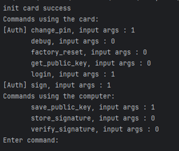
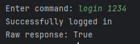
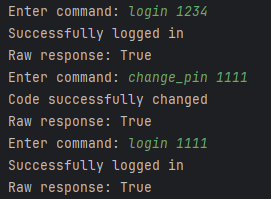
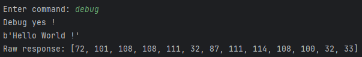
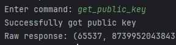
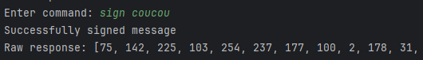
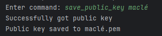
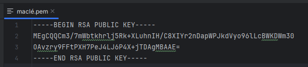
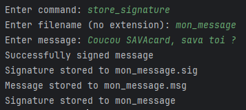
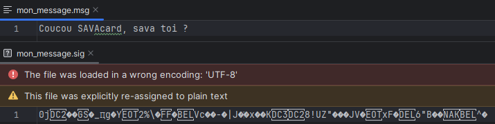

# javacard_host

## Prérequis

- Python 3.10
- Installer les dépendances avec la commande suivante :

```bash
pip install -r requirements.txt
```

- Avoir une carte JavaCard connectée à l'ordinateur avec l'applet du projet installée.

## Lancement

```bash
python main.py # ou python3 main.py
```

## Utilisation

Une fonction `main` est disponible dans le fichier `main.py`. Le script agit comme un terminal pour communiquer avec la carte. Ce script permet de tester les différentes fonctionnalités offertes par la carte.

- Vous pouvez utiliser le terminal en mode interactif pour tester les fonctionnalités une par une en excutant simplement le script.
- Sinon, il est possible d'exécuter tous les tests ,en décommentant `test_everything()` et commentant `repl()` dans le fichier `main.py`.

## Limitations

Il n'est possible de signer que des messages de taille inférieure à 127 octets. Cette limitation provient de l'implémentation de l'instruction de signature sur la carte.

Afin de palier à ce problème, il existe un workaround qui n'est pas activé pour une raison simple que nous allons détailler. Il existe une fonction qui permet de hasher en SHA-1 le message avant de l'envoyer à la carte pour signature. Cela permet donc d'avoir un message de 20 bytes, donc inférieur à la limitation sur la taille. En revanche la signature correspond au hash du hash du message. Ce qui ne correspond pas à ce que nous voulons, car nous voulons avoir la signature sur le hash du message.

### Exemple d'utilisation

Ensemble des commandes disponibles dans le script Python.



#### Login



#### Change PIN



#### Debug



#### Factory reset


#### Get public key



La méthode renvoie $e$ et $n$ permettant de reconstruire la clé publique.

#### Sign message



#### Save public key




#### Store signature




#### Verify signature

En utilisant les données précédemment sauvegardées, on peut vérifier la signature :


