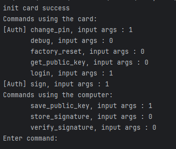
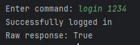
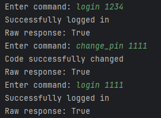
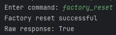
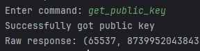
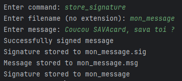
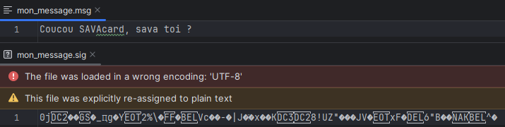
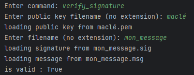
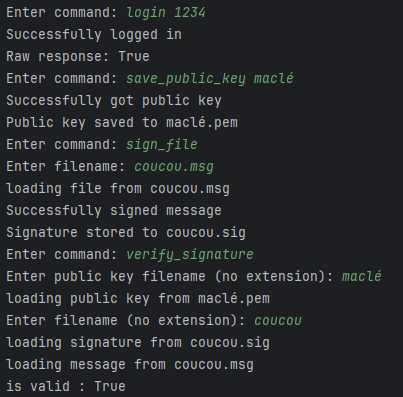

# python_client

## Prérequis

- Python 3.10
- Installer les dépendances avec la commande suivante :

```bash
pip install -r requirements.txt
```

## Lancement

```bash
python main.py # ou python3 main.py
```

## Utilisation

Une fonction `main` est disponible dans le fichier `main.py`. Elle permet de tester les différentes fonctionnalités de la carte.

- En décommentant `test_everything()` dans le fichier `main.py`, on peut tester toutes les fonctionnalités de la carte d'un coup.
- Sinon vous pouvez utiliser le terminal interactif pour tester les fonctionnalités une par une. (fonction `repl()`)

### Exemple d'utilisation



Les commandes utilisant l'ordinateur font appel à la carte pour faire les opérations.

#### Login



#### Change PIN



#### Debug


#### Factory reset



#### Get public key



La méthode renvoie $e$ et $n$ permettant de reconstruire la clé publique.

#### Sign message


#### Save public key


#### Store signature




#### Verify signature

En utilisant les données précédemment sauvegardées, on peut vérifier la signature :



#### Sign file


